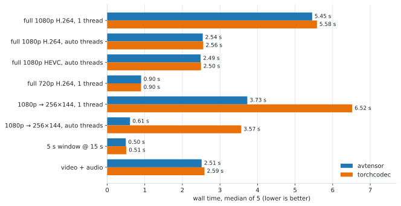

# avtensor

[](https://github.com/runwayml/avtensor/actions/workflows/ci.yml)
[](LICENSE)

High-performance media decoding straight into PyTorch tensors.

avtensor is a Rust library with Python bindings that decodes video, audio
and images into `torch.Tensor`s using FFmpeg. It is built for ML
data-loading pipelines: data moves directly from FFmpeg frames into tensors,
and the GIL is released while decoding. Inputs can be local files, `gs://` /
`s3://` objects or any HTTP(S) URL.

- Decode-time transforms inside FFmpeg: resize, frame-rate resampling,
  audio resampling, EBU R128 loudness normalization
- Color-correct output: YUV→RGB follows the stream's color metadata, and
  HDR sources are tone-mapped to sRGB
- Windowed decode of a start/end time range
- NVDEC hardware decode, optionally with GPU-resident output tensors

## Comparison with torchcodec

[torchcodec](https://github.com/meta-pytorch/torchcodec) is PyTorch's
official media decoder. Both decode through FFmpeg and produce bit-identical
RGB output on CPU decode. The focus differs, as of torchcodec 0.14:

| | avtensor | torchcodec |
| --- | --- | --- |
| cloud inputs (`gs://`, `s3://`) | native | — |
| video + audio | one decode pass | separate decoders |
| HDR | tone-mapped to SDR | `float32` output, no tone mapping (beta) |
| encoding | — | audio + video |

### Benchmarks

Median wall time on a 30 s 1080p H.264 clip (Xeon 8481C + H100, identical
FFmpeg builds). Whole-clip decode times are within ±1% of each other;
decode-time resize is 1.7–6× faster in avtensor. Full results, methodology,
and reproduction steps in [benchmarks/](benchmarks/):

<picture>
  <source media="(prefers-color-scheme: dark)" srcset="benchmarks/assets/single_decode_dark.svg">
  
</picture>

## Installation

Install from PyPI with `pip install avtensor`. The package is distributed as
source and compiles at install time against your environment's PyTorch
(libtorch) and FFmpeg >= 7.1 (shared build):

```bash
export LIBTORCH_USE_PYTORCH=1
export LIBTORCH_STATIC=0
export FFMPEG_PKG_CONFIG_PATH=/opt/ffmpeg/lib/pkgconfig
export LD_LIBRARY_PATH=/opt/ffmpeg/lib:$LD_LIBRARY_PATH
export LIBRARY_PATH=$LD_LIBRARY_PATH:$LIBRARY_PATH

pip install avtensor
```

To build a reusable wheel for deployment, use
[maturin](https://www.maturin.rs/): `maturin build --release -o wheelhouse/`.

Requirements:

| dependency | version | notes |
| --- | --- | --- |
| Python | >= 3.8 (CPython) | wheel is built per Python minor version |
| PyTorch | matches the `tch` pin in `Cargo.toml` (0.24.x ↔ torch 2.11) | linked dynamically at build time |
| FFmpeg | >= 7.1, shared libraries | needs `zscale`/`tonemap` filters (libzimg) for HDR input |
| Rust | stable toolchain | build-time only |

## Quickstart

```python
import avtensor
from avtensor import (
    AudioStreamRequest,
    MediaDecodeRequest,
    StreamType,
    VideoStreamRequest,
)

# Decode a video with its audio track.
request = MediaDecodeRequest("clip.mp4")
request.video_stream = VideoStreamRequest()
request.audio_streams = [AudioStreamRequest()]

streams = avtensor.decode_asset(request)

for stream in streams:
    if stream["stream_type"] == StreamType.Video:
        frames = stream["data"]      # uint8 Tensor, shape [T, C, H, W] (RGB)
        print(f"video: {frames.shape} @ {stream['fps']} fps")
    elif stream["stream_type"] == StreamType.Audio:
        samples = stream["data"]     # float32 Tensor, shape [C, T]
        print(f"audio: {samples.shape} @ {stream['sample_rate']} Hz")
```

### Resize and resample at decode time

```python
request = MediaDecodeRequest(
    "clip.mp4",
    video_stream=VideoStreamRequest(
        width=512,
        height=288,
        fps=24.0,          # frame-rate resampling
    ),
    audio_streams=[AudioStreamRequest(sample_rate=16000)],  # audio resampling
)

streams = avtensor.decode_asset(request)
```

### Decode a time window (seek)

```python
request = MediaDecodeRequest(
    "movie.mp4",
    start_time=42.0,   # seconds
    end_time=48.0,
    video_stream=VideoStreamRequest(),
    audio_streams=[AudioStreamRequest()],
)

streams = avtensor.decode_asset(request)
```

### Decode from cloud storage

```python
# Google Cloud Storage (Application Default Credentials):
request = MediaDecodeRequest("gs://my-bucket/path/clip.mp4")

# S3 (standard AWS credential chain):
request = MediaDecodeRequest("s3://my-bucket/path/clip.mp4")

# Any HTTP(S) URL FFmpeg can read — e.g. a presigned URL:
request = MediaDecodeRequest("https://my-bucket.s3.amazonaws.com/clip.mp4?X-Amz-...")
```

See [Reading from cloud storage](#reading-from-cloud-storage) for
credentials, custom endpoints and S3-compatible providers.

### In-memory assets and probing

`bytes` input decodes without touching the filesystem, and `probe_asset`
returns the stream layout without decoding:

```python
data: bytes = fetch_asset()  # e.g. from a queue or cache

meta = avtensor.probe_asset(data)
print(meta["video_streams"][0])  # {'index': 0, 'width': 1920, 'height': 1080, 'fps': 30.0}

request = MediaDecodeRequest(data, video_stream=VideoStreamRequest())
streams = avtensor.decode_asset(request)
```

### High bit-depth sources (float32 output)

By default frames are quantized to 8-bit RGB. For 10/12-bit sources
(HDR masters, ProRes, 10-bit H.264/HEVC), request `float32` output: FFmpeg
converts to planar float and avtensor returns `float32` tensors in `[0, 1]`
with the source's full precision. Unlike `uint8` output, float32 tensors are
contiguous in `NCHW` (the `NHWC` order is the view).

```python
request = MediaDecodeRequest(
    "10bit_master.mov",
    video_stream=VideoStreamRequest(dtype="float32"),
)
(video,) = avtensor.decode_asset(request)
video["data"].dtype  # torch.float32, values in [0, 1]
```

float32 output is 4× the memory of uint8 (a 30 s 1080p clip is ~22 GB);
decode a `start_time`/`end_time` window for long assets.

### Images

Images decode as a single-frame video stream:

```python
request = MediaDecodeRequest("photo.jpg")
request.video_stream = VideoStreamRequest()

(image,) = avtensor.decode_asset(request)
image["data"].shape  # [1, 3, H, W]
```

### GPU-accelerated decoding (NVDEC)

```python
request.video_stream = VideoStreamRequest(hardware_acceleration=True)
```

Bitstream decoding runs on the GPU's NVDEC engine (FFmpeg's `*_cuvid`
decoders); frames return to system memory, so filters and tensor conversion
are unchanged. A requested downscale runs on the GPU before the transfer,
shrinking the GPU→CPU copy. On 1080p production shots decoded to 256×144
this measured ~1.7× faster with ~3.4× less CPU than software decode.

Caveats: a GPU has a limited number of decode engines, so many concurrent
decodes can saturate them (software decode scales with cores instead). NVDEC
H.264 supports only 4:2:0 chroma. Requires an NVIDIA GPU and an FFmpeg build
with cuvid support.

#### GPU-resident output

With `device`, frames never leave the GPU: the returned tensor is
CUDA-resident, and NV12 → RGB conversion runs on the device (NPP), so the
GPU→CPU transfer and CPU color conversion disappear. Use it when the next
pipeline stage runs on the GPU.

```python
request.video_stream = VideoStreamRequest(
    hardware_acceleration=True,
    device="cuda",  # tensor lands on cuda:0
)
```

Constraints on this path:

- `width`/`height` must both be set to an even, strictly smaller size
  (NVDEC's own scaler) or both left unset.
- `fps` resampling and HDR tone mapping are unavailable; frames never reach
  the CPU filter graph.
- Values may differ from the CPU path by ±1 (NPP vs swscale rounding).

The CUDA runtime and NPP libraries must be present at run time. They are
`dlopen`ed, so CPU-only deployments carry no CUDA dependency.

### Loudness normalization

Audio can be loudness-normalized (FFmpeg `loudnorm`, EBU R128) during decode:

```python
from avtensor import LoudnessNormalization

norm = LoudnessNormalization(
    integrated_loudness_target=-18.0,  # LUFS
    true_peak_level_target=-1.0,       # dBTP
    loudness_range_target=7.0,         # LU
)

request = MediaDecodeRequest(
    "clip.mp4",
    audio_streams=[AudioStreamRequest(loudness_normalization=norm)],
)
```

## API reference

### `decode_asset(request: MediaDecodeRequest) -> list[DecodeResult]`

Decodes the requested streams. Returns one result dict per decoded stream:

| key | video streams | audio streams |
| --- | --- | --- |
| `data` | `uint8` Tensor `[T, C, H, W]`, RGB (`float32` in `[0, 1]`, NCHW-contiguous, with `dtype="float32"`; `[T, H, W, C]` with `dimension_order="NHWC"`) | `float32` Tensor `[C, T]` |
| `stream_type` | `StreamType.Video` | `StreamType.Audio` |
| `stream_index` | index of the stream in the container | index of the stream in the container |
| `fps` | output frame rate | — |
| `pts` | `float64` Tensor `[T]`, presentation timestamp of each frame in seconds | — |
| `sample_rate` | — | output sample rate in Hz |

The GIL is released for the duration of the decode.

### `probe_asset(input: str | bytes) -> MediaMetadata`

Returns the asset's stream layout without decoding it: a dict with
`video_streams` (each with `index`, `width`, `height`, `fps`) and
`audio_streams` (each with `index`, `sample_rate`). Accepts the same inputs
as `MediaDecodeRequest`. The GIL is released while probing.

### `MediaDecodeRequest(input: str | bytes)`

| attribute | type | meaning |
| --- | --- | --- |
| `input` | `str \| bytes` | local path, `gs://` / `s3://` URI, HTTP(S) URL or the raw bytes of an in-memory asset |
| `start_time` | `float \| None` | decode window start, in seconds |
| `end_time` | `float \| None` | decode window end, in seconds |
| `video_stream` | `VideoStreamRequest \| None` | request the video stream (`None` = skip video) |
| `audio_streams` | `list[AudioStreamRequest] \| None` | audio streams to decode (`None` = skip audio) |

All request classes accept their attributes as keyword arguments
(`VideoStreamRequest(width=512, height=288)`). Nested request objects are
held by reference, so mutating `request.video_stream` (or an element of
`request.audio_streams`) after assignment is reflected in `decode_asset`.

### `VideoStreamRequest`

All attributes default to `None`, meaning "keep the source value".

| attribute | type | meaning |
| --- | --- | --- |
| `index` | `int \| None` | select a specific video stream |
| `width`, `height` | `int \| None` | rescale output frames |
| `fps` | `float \| None` | resample to this frame rate |
| `number_of_threads` | `int \| None` | FFmpeg decoder threads (default: 1; `0` = FFmpeg auto) |
| `hardware_acceleration` | `bool \| None` | decode on the GPU's NVDEC engine (see [GPU-accelerated decoding](#gpu-accelerated-decoding-nvdec)) |
| `dimension_order` | `str \| None` | `"NCHW"` (default, `[T, C, H, W]`, a non-contiguous view) or `"NHWC"` (`[T, H, W, C]`, contiguous) |
| `device` | `str \| None` | `"cuda"` / `"cuda:N"`: keep frames on the GPU (see [GPU-accelerated decoding](#gpu-accelerated-decoding-nvdec)) |
| `dtype` | `str \| None` | `"uint8"` (default) or `"float32"` (`[0, 1]`, NCHW-contiguous, preserves 10/12-bit source depth) |

### `AudioStreamRequest`

| attribute | type | meaning |
| --- | --- | --- |
| `index` | `int \| None` | select a specific audio stream |
| `sample_rate` | `int \| None` | resample to this rate |
| `loudness_normalization` | `LoudnessNormalization \| None` | apply EBU R128 loudness normalization |

### `LoudnessNormalization`

Mirrors FFmpeg's [`loudnorm`](https://ffmpeg.org/ffmpeg-filters.html#loudnorm)
filter: `integrated_loudness_target` (LUFS), `true_peak_level_target` (dBTP),
`loudness_range_target` (LU), the `measured_*` variants for two-pass
normalization, `offset_gain`, `linear` and `dual_mono`.

## Reading from cloud storage

`gs://` and `s3://` objects are fetched with streaming reads and concurrent
range requests on seek, buffered in memory (`AVTENSOR_MAX_CLOUD_OBJECT_BYTES`
caps the buffer; default 16 GiB). HTTP(S) inputs go through FFmpeg's own
protocol layer.

### Google Cloud Storage (`gs://`)

Authentication uses
[Application Default Credentials](https://cloud.google.com/docs/authentication/application-default-credentials).
Set `GCS_ENDPOINT` to point at a different GCS-API-compatible endpoint
(defaults to `https://storage.googleapis.com`).

### Amazon S3 and S3-compatible stores (`s3://`)

Credentials and region come from the standard AWS provider chain
(`AWS_ACCESS_KEY_ID`/`AWS_SECRET_ACCESS_KEY`, `AWS_PROFILE`, IMDS, ...).
S3-compatible providers work by overriding the endpoint:

```bash
export AWS_ENDPOINT_URL_S3=https://objects.example.com

# MinIO and other path-style-only stores additionally need:
export AVTENSOR_S3_FORCE_PATH_STYLE=1
```

### Anything else: presigned HTTP(S) URLs

Any provider that can issue a presigned or public HTTP(S) URL works without
provider-specific support — the URL is handed to FFmpeg's http protocol.

## Color handling

- YUV→RGB conversion uses the colorspace and range tagged on the stream,
  rather than letting FFmpeg guess from the resolution.
- HDR sources — HLG (`arib-std-b67`) or PQ (`smpte2084`) transfer or BT.2020
  primaries — are automatically tone-mapped
  (`zscale` → `tonemap=hable` → `zscale`) so the returned RGB tensors are
  sRGB/BT.709, consistent with SDR sources.

## Troubleshooting

- **Build fails with "Cannot find a libtorch install"** — set
  `LIBTORCH_USE_PYTORCH=1` and make sure `python -c "import torch"` works in
  the active environment.
- **Build fails with FFmpeg/pkg-config errors** — set
  `FFMPEG_PKG_CONFIG_PATH` to the directory containing `libavcodec.pc` etc.,
  and make sure the FFmpeg is a *shared* (not static) build, version >= 7.1.
- **`ImportError: libavcodec.so.61: cannot open shared object file`** — the
  FFmpeg libraries must be on `LD_LIBRARY_PATH` at runtime, matching the
  version the wheel was built against.
- **Hardware decode fails with `CUDA_ERROR_NOT_SUPPORTED`** — the stream's
  format exceeds NVDEC's capabilities; for H.264 only 4:2:0 chroma is
  supported (4:4:4 will not decode).
- **HDR decode fails with a filter error** — your FFmpeg lacks the `zscale`
  filter (libzimg); use a build that includes it.
- **`s3://` works with AWS but not with your S3-compatible store** — check
  whether the store requires path-style addressing
  (`AVTENSOR_S3_FORCE_PATH_STYLE=1`) and that `AWS_ENDPOINT_URL_S3` is set.

## Contributing

Issues and pull requests are welcome. Project layout:

```
src/
  decoder/       demuxing, decoding, filter graphs (mod.rs), cloud AVIO reader (io.rs)
  ffi/           PyO3 bindings: request/response types, decode_asset
  util/          gcs/s3 URI handling, memory, test media generation
avtensor.pyi     Python type stubs, shipped with the wheel
```

Set the environment variables from [Installation](#installation) first —
builds and tests fail without them. CI enforces all of the following:

```bash
make test              # cargo test --no-default-features (required PyO3 workaround)
cargo fmt --check
cargo clippy --no-default-features --all-targets -- -D warnings

# Python tooling (benchmarks/):
ruff check benchmarks/ && ruff format --check benchmarks/
ty check

# Line coverage (65% floor):
cargo llvm-cov --no-default-features --summary-only
```

The test suite is self-contained: all test media is generated locally with
FFmpeg at test time. A performance-regression gate also runs on every PR.
While debugging, `RUST_LOG=debug RUST_BACKTRACE=1` enables native logs and
backtraces; errors are forwarded to Python logging by default.

`Cargo.lock` is pinned deliberately — wheels link against FFmpeg and
libtorch, and downstream deployments validate specific versions. Bump
dependencies intentionally rather than accepting automated lockfile
updates.

## License

[Apache 2.0](LICENSE)
