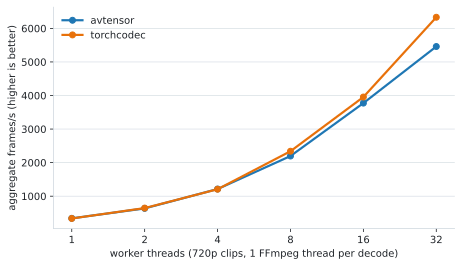

# Benchmarks: avtensor vs torchcodec

Reproducible comparison of avtensor against
[torchcodec](https://github.com/meta-pytorch/torchcodec), the PyTorch-native
media decoder. Both libraries decode via FFmpeg into `torch.Tensor`s, so this
measures the overhead and design choices of each wrapper, not FFmpeg itself.

## Running

```bash
# Build/install avtensor (see the top-level README), then:
pip install torchcodec

# Same FFmpeg for both libraries at runtime:
export LD_LIBRARY_PATH=/opt/ffmpeg/lib:$LD_LIBRARY_PATH
export FFMPEG=/opt/ffmpeg/bin/ffmpeg   # used for fixture preparation

python benchmarks/benchmark.py -o results.json
```

The first run downloads the Big Buck Bunny 1080p source (~276 MB, CC-BY) and
cuts three fixtures with the local FFmpeg (H.264 1080p/30 s, HEVC 1080p/30 s,
H.264 720p/10 s, all with AAC stereo audio). Subsequent runs reuse them.
Select scenarios with `--scenarios single,concurrency,nvdec,correctness`.

## Methodology

- Wall time is the **median of 5 runs** after 1 warmup run (page cache warm
  for both libraries); CPU time via `getrusage`.
- The harness verifies at startup that both libraries actually loaded the
  **same libavcodec build** (avtensor links at build time, torchcodec
  dlopens at runtime) and aborts otherwise; the loaded path is recorded in
  the results JSON.
- FFmpeg decoder thread counts are always set explicitly and matched per
  scenario (`number_of_threads` / `num_ffmpeg_threads`; both libraries
  default to 1). `threads=0` means FFmpeg auto.
- Decode-time resize uses each library's native path: avtensor
  `VideoStreamRequest.width/height` (swscale in the filter graph) vs
  torchcodec's `Resize` decoder transform.
- The concurrency scenario decodes the 720p clip from `W` Python worker
  threads (1 FFmpeg thread per decode, 3 jobs per worker) and reports
  aggregate frames/s, modeling a threaded data-loading pipeline.
- NVDEC caveat: the two libraries do different work — avtensor returns
  **CPU** tensors (GPU-side resize, then frames copied back to system
  memory), torchcodec `device="cuda"` returns **GPU-resident** tensors with
  CUDA color conversion and no copy back. torchcodec does not support decoder
  transforms on CUDA, so the NVDEC resize case pairs avtensor's GPU resize
  against torchcodec NVDEC decode + `F.interpolate`.
- Correctness: both libraries' RGB output for the 720p clip is compared
  frame-by-frame.

## Results

Measured 2026-07-08 on an Intel Xeon Platinum 8481C (208 cores) with an
NVIDIA H100, torch 2.11.0+cu130, torchcodec 0.14.0+cu130, avtensor 0.2.0,
FFmpeg n7.1.1 (shared, same build for both libraries). Times are the median
of 5 runs; `speedup` > 1 means avtensor is faster. Raw output:
[`results/2026-07-08-xeon8481c-h100.json`](results/2026-07-08-xeon8481c-h100.json);
charts are regenerated with `python benchmarks/make_charts.py <results.json>`
(needs matplotlib).

### Single decode (wall time, whole clip to tensors)

<picture>
  <source media="(prefers-color-scheme: dark)" srcset="assets/single_decode_dark.svg">
  
</picture>

| scenario | avtensor | torchcodec | speedup |
| --- | --- | --- | --- |
| full 1080p H.264, 1 thread | 5.454 s (165 fps) | 5.582 s (161 fps) | 1.02x |
| full 1080p H.264, auto threads | 2.542 s (354 fps) | 2.556 s (352 fps) | 1.01x |
| full 1080p HEVC, auto threads | 2.486 s (362 fps) | 2.495 s (361 fps) | 1.00x |
| full 720p H.264, 1 thread | 0.903 s (332 fps) | 0.900 s (333 fps) | 1.00x |
| 1080p → 256×144, 1 thread | 3.728 s (241 fps) | 6.519 s (138 fps) | 1.75x |
| 1080p → 256×144, auto threads | 0.607 s (1482 fps) | 3.566 s (252 fps) | 5.87x |
| 5 s window @ 15 s, 1080p | 0.495 s | 0.508 s | 1.03x |
| audio 48 kHz (30 s) | 0.040 s | 0.032 s | 0.79x |
| audio resampled to 16 kHz | 0.048 s | 0.039 s | 0.83x |
| video + audio, one asset | 2.513 s | 2.589 s | 1.03x |

### Concurrent decode throughput (720p clips, 1 FFmpeg thread per decode)

<picture>
  <source media="(prefers-color-scheme: dark)" srcset="assets/concurrency_dark.svg">
  
</picture>

| worker threads | avtensor frames/s | torchcodec frames/s |
| --- | --- | --- |
| 1 | 340 | 336 |
| 2 | 636 | 645 |
| 4 | 1213 | 1208 |
| 8 | 2197 | 2340 |
| 16 | 3773 | 3955 |
| 32 | 5460 | 6332 |

### NVDEC hardware decode (1080p H.264, 30 s)

| scenario | avtensor (CPU tensors) | torchcodec `device="cuda"` (GPU tensors) |
| --- | --- | --- |
| NVDEC full 1080p | 4.066 s | 1.278 s |
| NVDEC 1080p → 256×144 | 1.589 s | 1.331 s (decode + `F.interpolate`) |

### Correctness

Frame-by-frame comparison of the 720p clip: same frame count (300), RGB
output **bit-identical** (max abs diff 0).

## Summary

- Full-clip software decode: within ±3% of each other at matched thread
  counts.
- Decode-time resize (1080p → 256×144): avtensor is 1.8× faster at 1
  thread and ~6× faster at auto threads. Scaling overlaps with decoding,
  and output writes shrink with the output size.
- Concurrent throughput: equal through 4 workers; torchcodec is 5–16%
  faster at 8–32 workers on this machine.
- NVDEC: torchcodec's `device="cuda"` keeps frames on the GPU and is 3.2×
  faster at full resolution. avtensor transfers frames back to system
  memory; with GPU-side resize the downscaled-to-CPU case is within 20%.
- Audio decode differs by < 10 ms on 30 s of stereo.
- Results are machine- and content-dependent; rerun on your own hardware
  and clips.

## Performance notes (for contributors)

- **Conversion-only streams bypass the filter graph** (`DirectPath` in
  `decoder/mod.rs`): video whose only processing is YUV→RGB conversion is
  written by `sws_scale` straight into the preallocated output tensor, and
  audio with no resampling or loudness normalization skips the `anull`
  (no-op) graph it would otherwise run. In both cases no graph is built.
  The graph materializes its own output `AVFrame` (a full extra copy of
  every frame) and builds a slice-threading worker pool per decode, so it
  is reserved for the cases that need it: resizing, fps resampling, HDR
  tone mapping, hardware decode, and output widths that are not a multiple
  of 32. Output is bit-identical on either path;
  `AVTENSOR_DISABLE_DIRECT_PATH=1` forces the graph for debugging.
- **Resizes use the filter graph**: its `scale` filter downscales with
  slice threading in subsampled YUV, which measures faster than a
  single-threaded one-pass `sws_scale`. The resize speedup relative to
  torchcodec comes from ~56× smaller output writes plus scaling that
  overlaps with decoding; torchcodec's `Resize` runs on the decode thread.
  The graph's slice-threading pool is capped at 16 workers (FFmpeg's
  default is one per core, a large per-decode cost on many-core machines);
  slice threading cannot use more workers than there are output rows, so
  the cap does not slow single decodes.
- **NVDEC full-res is transfer-bound**: frames are downloaded to system
  memory and color-converted on CPU. GPU-resident output
  ([#10](https://github.com/runwayml/avtensor/issues/10)) would close the
  gap with torchcodec's `device="cuda"`; GPU-side resize already makes the
  downscaled-to-CPU case competitive.
- **The video result is a non-contiguous view** (`permute`, sometimes
  `narrow`) of the internal `[T, H, W, C]` buffer — torchcodec's default
  `NCHW` output behaves the same way — and an over-allocated buffer stays
  alive for as long as the returned tensor does.
